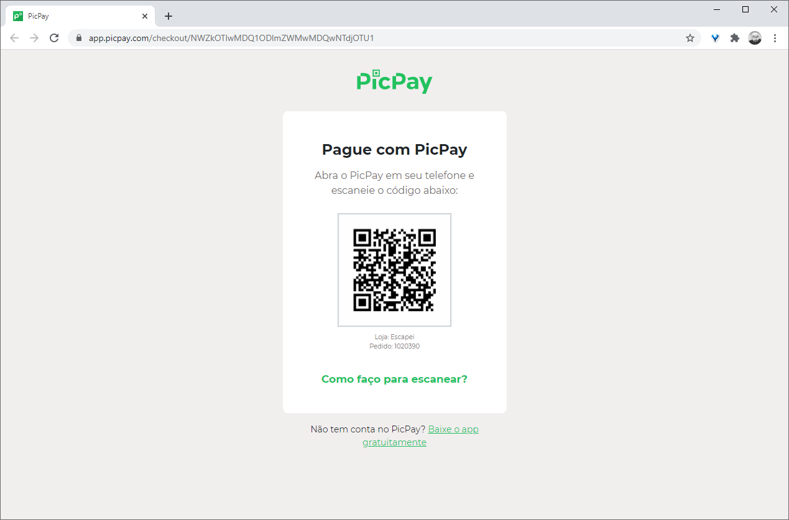
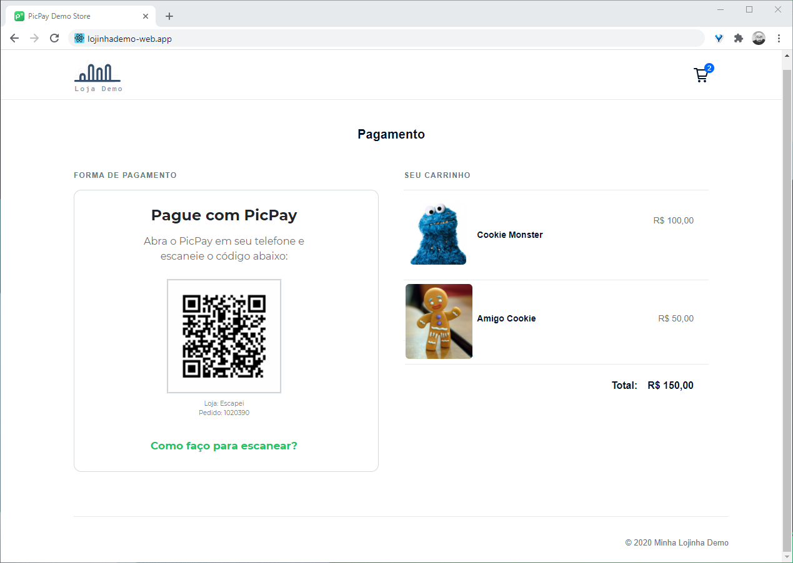

# Aceitando pagamentos com a API pública

## Sobre este guia
Neste guia vamos descrever o passo-a-passo para que você aceite pagamentos online com PicPay, assim como o fluxo básico de um pagamento com QR Code e o ciclo de vida dos pagamentos.

## Pré-requisitos

Antes de iniciar sua integração, você deve possuir credenciais válidas. Você pode conferir como obter suas credenciais [neste artigo](/checkout/intro/getting-started#antes-de-começar).


## Como funciona?

### Autenticação

O PicPay disponibiliza duas chaves de integração: O `x-picpay-token` e o `x-seller-token`. Para esta operação, você deverá utilizar o `x-picpay-token` em suas requisições.

### Funcionamento básico

O PicPay funciona como uma forma de pagamento **assíncrona**, ou seja, uma intenção de pagamento é gerada através de nossa API de pagamento e permanece com o status `pending` até que o usuário efetue o pagamento com o aplicativo verdinho. Veja abaixo o fluxo básico de funcionamento dos pagamentos via QR Code.


**Passo 1**: O cliente seleciona o PicPay como forma de pagamento em seu e-commerce;

**Passo 2:** Seu e-commerce deve efetuar uma chamada (server-side) para nossa API de pagamentos (/payments), gerando uma intenção de pagamento com status pending dentro do PicPay;

```bash
curl --location --request POST 'https://appws.picpay.com/ecommerce/public/payments'  \ 
--header 'x-picpay-token: {sua_chave_de_integracao}'  \ 
--header 'Content-Type: application/json'  \ 
--data-raw '{ "referenceId": "102039", 
    "callbackUrl": "http://localhost/mockVtexPostCallback/?httpStatus=200", 
    "expiresAt": "2020-12-12T15:53:00+05:00", 
    "returnUrl": "http://www.picpay.com/#transacaoConcluida", 
    "value": 10, 
    "additionalInfo": [ null ], 
    "buyer": { 
        "firstName": "João", 
        "lastName": "dos Testes", 
        "document": "010.091.001-91" 
    } 
}'
```

_Exemplo de request: O e-commerce cria uma intenção de pagamento de 10 reais no PicPay para o cliente João dos Testes_

**Passo 3:** O PicPay devolve o QR Code no retorno da chamada da API de pagamentos (URL para redirecionamento em paymentUrl e imagem codificada em qrcode.base64);

```json
{  
    "referenceId":  "102039",  
    "paymentUrl":  "https://app.picpay.com/checkout/NWZkOTFjZTA4.....ZWJmM2QxMzA2",  
    "qrcode":  {  
        "content":  "https://app.picpay.com/checkout/NWZkOTFjZTA4.....ZWJmM2QxMzA2",  
        "base64":  "data:image/png;base64,iVBORw0KGgoAAAANSUhEUgAAAZAAAAGQCAIAAAAP3aGb...(muitos caracteres)..II="  
    },  
    "expiresAt":  "2020-12-12T08:53:00-02:00"  
}
```


_Exemplo de response para o request do passo 3._

**Passo 4:** No seu e-commerce, você exibe o QR code para seu cliente efetuando o redirecionando para a URL ou exibindo o QR Code;


*Imagem 2 - Exemplo utilizando redirecionamento*



*Imagem 3 - Exemplo utilizando o QRCode na página*

**Passo 5:** Caso identificarmos que seu cliente também é cliente PicPay, iremos enviar uma notificação dentro do aplicativo PicPay avisando sobre o pagamento pendente. Em todos os casos iremos enviar um e-mail de pagamento pendente contendo o link de nossa página de checkout. Neste momento, teremos uma intenção de pagamento com o status pending (saiba mais sobre o ciclo de vida dos pagamentos aqui);

**Passo 6:** O cliente efetua o pagamento através do App PicPay (Com saldo ou cartão de crédito).

:::info Informação
Caso o cliente não efetue o pagamento até a data de expiração (enviada no momento de criação), o pagamento passará para o status expired
:::

**Passo 7:** Caso o pagamento seja bem sucedido, o PicPay envia uma notificação para o e-commerce via **POST** na URL de _callback,_ fornecida na requisição de pagamento como callbackUrl.

Seu e-commerce deverá estar preparado para receber um **POST** no endpoint /callback, utilizando o x-seller-token no _header_ para autenticação da requisição. Para que o recebimento do _callback_ seja considerado confirmado, seu e-commerce deve responder com **HTTP Status 200**.

```bash
curl -X POST \ http://www.sualoja.com.br/callback \ 
    -H 'Content-Type: application/json'  \ 
    -H 'x-seller-token: 4ef4edbd-5cda-42da-860b-0e8d7b90c784'  \ 
    -d '{   
            "referenceId" : "102030", 
            "authorizationId" : "555008cef7f321d00ef236333" 
        }'
```

_Exemplo de notificação que o PicPay envia para o e-commerce._

:::info Informação
Porém, por questões de segurança, não iremos informar o novo status nesta requisição. Para isto, sua loja (a partir do recebimento de nossa notificação) deverá consultar nosso endpoint de status de pedidos.
:::

:::caution Atenção

Se o callback não chegar após o tempo determinado por você, recomendamos que uma consulta do status da ordem seja feita de forma direta (**passo 8**). Isso é aplicável para casos que precisem de confirmações instântaneas (compras presenciais ou vending-machines, por exemplo).

:::

Saiba mais sobre as notificações que o PicPay envia [neste artigo](/checkout/guides/notifications).

**Passo 8:** O seu e-commerce deve efetuar um GET utilizando o referenceId que enviamos por notificação, através para obtenção do status do pagamento.

```bash
curl -X GET \ https://appws.picpay.com/ecommerce/public/payments/{referenceId}/status \ 
    -H 'Content-Type: application/json'  \ 
    -H 'x-picpay-token: {sua_chave_de_integracao}'  \  }'
```

_Exemplo de notificação que o PicPay envia para o e-commerce._

**Passo 9:** Caso o pagamento esteja confirmado, exibir confirmação no seu e-commerce.


## Próximos passos

- [Entenda os possíveis status de um pagamento](/checkout/guides/order-status);
- [Entenda como solicitar um cancelamento total](/checkout/guides/cancel-order);
- [Entenda um pouco mais sobre as notificações que o PicPay envia](/checkout/guides/notifications);


## Obtendo ajuda
Esperamos ter ajudado com este artigo! Caso tenha restado alguma dúvida, você pode consultar o nosso FAQ ou entrar em contato através do e-mail relacionamento-empresas@picpay.com. 

 